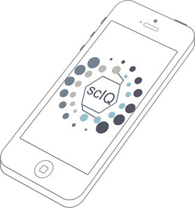

# Skin care. Personalized. Smarter. Easier.

Skinalytics is developing tools to help users select skin care products and avoid adverse skin reactions.

Our first product, scIQ, adds intelligence to selecting skin care products to make it more personalized, easier, and faster. 

It uses crowdsourced data about skin type, demographics, geography, and skin care product sensitivities with a product ingredient database to better understand contact irritant dermatitis, a form of dermatitis that might occur due to sensitization of your skin to an ingredient or ingredients in skin care products. We use analytics and machine learning to determine ingredients for you to avoid based on your skin type, demographics, and geography and what we've learned from others like you who have experienced skin reactions. In addition, you can be connected to or read product reviews from others with similar skin types, demographics, and geography for further confidence that you are picking products just right for you.

## Join Our Community.

We are currently looking for participants that may be interested in joining our sensitive skin community (whether you have experienced a skin sensitivity or not) or that may be interested in testing our prototype app. Participants in the sensitive skin community could be ages 13-80 years old, male or female. If you would like to participate or would like more information, please contact us at 

**<info@skinalytics.me>**.

## We are Constantly Improving.

This site is currently under construction. Please check back with us because we plan to have a live registration page for those interested in joining our sensitivie skin community by the beginning of Q3 of 2017. If you would like to provide comments or would like more information about our products, please contact us at

**<info@skinalytics.me>**.
